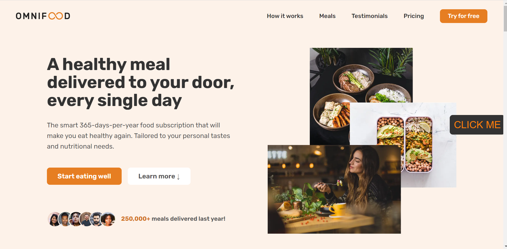
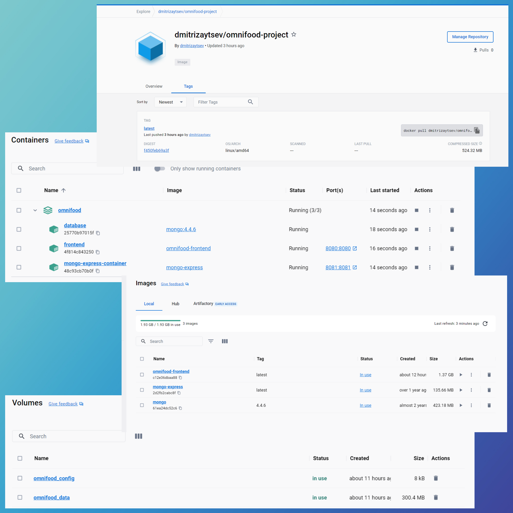

### About:

# Omnifood Project

### Links

Live site: (https://omnifoodai-site.netlify.app/)

## Overview

#### Used technologies:

- CSS3
- HTML5
- JS(ES6+)
- Webpack
- Docker
   

### What was realized?

1. Used media queries and JS for creating Mobile navigation.

 

2. Created ability to drag item without Drap and Drop Api. When it is above the red circle, the circle changes color. After dropping item on circle, these two elements are deleted.

 

3. Realized smooth scrolling, sticky navigation with JS.

<strong>For cross-browser compatibility:</strong>

4. Used polyfill to support scroll bevavior "smooth". Used JS as an alternative to `@supports`. This was done more for practice than for real support. Also added vendors thanks to Webpack.

Support for last versions of browsers:

    <picture>
        <source
                type="image/webp"
                srcset="img\omnifood-logo.webp"
                sizes="22" />
        
    </picture>

 

### With Webpack was implemented:

- concatenation, prefixing and compressing CSS
- transpiling and compressing JS modules
- compressing html
- minification images and convertion to .webp
 

### Usage Docker in project

1. Containers are connected by omnifood_network

2. Database container have 2 volumes - omnifood_data and omnifood_config

3. Mongo-express-container(needed for management of data using web-interface) is connected to database container.

4. Dockerfile created for building frontend part(all components in this directory)

5. Docker compose file created for building frontend and backend part(mongodb and mongo-express)
 

This is structure and my Docker Hub profile:

And received result:

## 🚀Quick Setup

1.  Clone this repository:

        git clone https://github.com/DmitriZaitsev/Omnifood-AI.git

2.  Install npm packages:

        npm i

3.  Open site in browser:

        npm start

## Setup with Docker
 
Install Docker and then...

### Variant 1(build whole app)

        docker compose up -d

### Variant 2(build frontend part)

1.  Pull image

        docker pull dmitrizaytsev/omnifood-project

2.  Run container

        docker run -p 8080:8080 --name frontend omnifood-project

### Variant 3(build frontend part)

1.  Build image

        docker build -t omnifood-frontend .

2.  Run container

        docker run -p 8080:8080 --name frontend omnifood-frontend

---

### 💌Contacts

Telegram: [@dmitr1_zaytsev](https://t.me/dmitr1_zaytsev)

Mail: <dmitri_zaytsev@bk.ru>
